# 1. Полное описание задания

## Контекст

Вы — junior-разработчик в компании, которая консультирует бизнес по оптимизации процессов. Ваш руководитель попросил создать **веб-инструмент** для визуальной приоритизации бизнес-процессов клиента.

Инструмент должен позволять:

1. Ввести список бизнес-процессов
2. Оценить каждый процесс по двум группам критериев (операционная эффективность и стратегическая важность)
3. Автоматически рассчитать средние оценки
4. Распределить процессы по **4 зонам матрицы**
5. Сохранить работу в браузере

---

## Матрица приоритизации — напоминание

Матрица строится по двум осям:

- **Ось X** — текущая операционная эффективность (среднее по операционным критериям)
- **Ось Y** — стратегическая важность (среднее по стратегическим критериям)

**Порог деления** — значение **3.0** (из 5).

<div class="priority-matrix">
  <div class="matrix-cell matrix-q1">
    <h4>Зона 1: Срочные изменения</h4>
    <p>Эффективность &lt; 3.0<br/>Важность &ge; 3.0<br/><strong>Красная зона</strong></p>
  </div>
  <div class="matrix-cell matrix-q2">
    <h4>Зона 2: Развитие</h4>
    <p>Эффективность &ge; 3.0<br/>Важность &ge; 3.0<br/><strong>Зелёная зона</strong></p>
  </div>
  <div class="matrix-cell matrix-q3">
    <h4>Зона 3: Стандартизация</h4>
    <p>Эффективность &lt; 3.0<br/>Важность &lt; 3.0<br/><strong>Жёлтая зона</strong></p>
  </div>
  <div class="matrix-cell matrix-q4">
    <h4>Зона 4: Мониторинг</h4>
    <p>Эффективность &ge; 3.0<br/>Важность &lt; 3.0<br/><strong>Синяя зона</strong></p>
  </div>
</div>

---

## Критерии оценки процесса

Каждый процесс оценивается по **8 критериям** (шкала 1–5):

### Операционные критерии (4 шт.)

| Критерий | Код в JS | Что оценивает |
|---|---|---|
| Время цикла | `cycleTime` | Насколько быстро выполняется процесс |
| Стоимость | `cost` | Затраты на единицу выполнения |
| Автоматизация | `automation` | Доля автоматизированных шагов |
| Доля переделок | `rework` | Как часто приходится переделывать |

### Стратегические критерии (4 шт.)

| Критерий | Код в JS | Что оценивает |
|---|---|---|
| Стратегическая значимость | `strategicValue` | Вклад в цели организации |
| Критичность | `criticality` | Последствия при сбое |
| Инновационный потенциал | `innovation` | Возможность применения новых технологий |
| Техдолг | `techDebt` | Ограничения текущих ИС |

!!! hint "Шкала оценки"

    **1** = очень плохо, **5** = отлично. Все оценки — целые числа от 1 до 5.

---

## Формулы расчёта

```
operationalAvg = (cycleTime + cost + automation + rework) / 4

strategicAvg = (strategicValue + criticality + innovation + techDebt) / 4
```

**Определение зоны:**

```
if (operationalAvg < 3.0 && strategicAvg >= 3.0) → Зона 1 (Срочные изменения)
if (operationalAvg >= 3.0 && strategicAvg >= 3.0) → Зона 2 (Развитие)
if (operationalAvg < 3.0 && strategicAvg < 3.0)  → Зона 3 (Стандартизация)
if (operationalAvg >= 3.0 && strategicAvg < 3.0)  → Зона 4 (Мониторинг)
```

---

## Начальные данные (для тестирования)

В коде должен быть **массив из 6 процессов** для демонстрации. Используйте данные из кейса «ТрансЛогистик»:

```javascript
const initialProcesses = [
  {
    id: 1,
    name: "Приём и обработка заявки",
    type: "Основной",
    cycleTime: 2, cost: 3, automation: 2, rework: 4,
    strategicValue: 5, criticality: 4, innovation: 5, techDebt: 2
  },
  {
    id: 2,
    name: "Планирование маршрутов",
    type: "Основной",
    cycleTime: 1, cost: 2, automation: 1, rework: 5,
    strategicValue: 5, criticality: 5, innovation: 5, techDebt: 1
  },
  {
    id: 3,
    name: "Исполнение рейса",
    type: "Основной",
    cycleTime: 3, cost: 3, automation: 2, rework: 3,
    strategicValue: 4, criticality: 5, innovation: 4, techDebt: 2
  },
  {
    id: 4,
    name: "Расчёт стоимости и счета",
    type: "Поддерживающий",
    cycleTime: 2, cost: 2, automation: 2, rework: 4,
    strategicValue: 3, criticality: 4, innovation: 3, techDebt: 2
  },
  {
    id: 5,
    name: "Управление парком (ТО)",
    type: "Поддерживающий",
    cycleTime: 4, cost: 4, automation: 3, rework: 2,
    strategicValue: 3, criticality: 4, innovation: 3, techDebt: 3
  },
  {
    id: 6,
    name: "Работа с претензиями",
    type: "Управленческий",
    cycleTime: 1, cost: 2, automation: 1, rework: 5,
    strategicValue: 4, criticality: 3, innovation: 4, techDebt: 1
  }
];
```

---

## Структура файлов проекта

```
my-priority-matrix/
├── index.html      ← разметка страницы
├── style.css       ← стили (или style.scss)
└── app.js          ← вся логика на vanilla JS
```

!!! task "Результат сдачи"

    1. Создайте репозиторий на GitHub (например, `priority-matrix`)
    2. Загрузите в него файлы проекта
    3. Пришлите ссылку на репозиторий преподавателю
    4. В `README.md` кратко опишите: что делает приложение, как запустить (открыть `index.html` в браузере)

---

## Распределение времени (рекомендация)

```mermaid
gantt
    title План работы на 4 часа
    dateFormat HH:mm
    axisFormat %H:%M

    section Этап 1
    HTML-структура и CSS          :a1, 00:00, 60min

    section Этап 2
    Рендеринг таблицы и матрицы   :a2, after a1, 70min

    section Этап 3
    Форма, удаление, фильтры      :a3, after a2, 60min

    section Этап 4
    localStorage и экспорт         :a4, after a3, 40min

    section Финал
    Тестирование и загрузка на GitHub :a5, after a4, 10min
```



!!! hint "Не успеваете?"

    Этапы расположены **по приоритету**. Если не успеваете за 4 часа — сосредоточьтесь на этапах 1–3 (16 баллов). Этап 4 можно доделать дома. Главное — **работающее приложение**, которое рендерит таблицу и матрицу.
