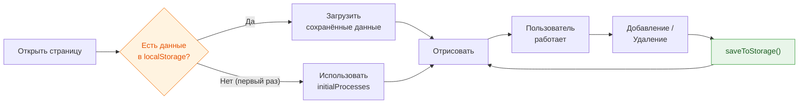

# 5. Этап 4 — Хранение и экспорт <span class="points-badge">4 балла</span>

## Цель этапа

Сделать так, чтобы данные **не терялись при обновлении страницы**, и добавить возможность экспорта.

---

## 4.1 Сохранение в localStorage

`localStorage` — встроенное хранилище браузера. Данные сохраняются **даже после закрытия вкладки**.

```javascript
// ========== ХРАНЕНИЕ ==========

function saveToStorage() {
  var data = JSON.stringify(processes);
  localStorage.setItem('priorityMatrix', data);
}

function loadFromStorage() {
  var data = localStorage.getItem('priorityMatrix');
  if (data) {
    processes = JSON.parse(data);
  }
}
```

!!! concept "JSON.stringify и JSON.parse"

    - `JSON.stringify(obj)` — превращает JavaScript-объект в **строку** (localStorage хранит только строки)
    - `JSON.parse(str)` — превращает строку обратно в **объект**

    Это стандартный способ сохранения структурированных данных в localStorage.

---

## 4.2 Интеграция с существующим кодом

Теперь нужно:

1. **Загружать данные** из localStorage при открытии страницы
2. **Сохранять данные** после каждого изменения

Обновите функцию `renderAll`:

```javascript
function renderAll() {
  renderTable();
  renderMatrix();
  saveToStorage(); // Сохраняем после каждой перерисовки
}
```

Обновите блок запуска:

```javascript
document.addEventListener('DOMContentLoaded', function() {
  // Загружаем сохранённые данные (если есть)
  loadFromStorage();

  // Подключаем обработчики
  document.getElementById('process-form')
    .addEventListener('submit', handleAddProcess);
  document.getElementById('table-body')
    .addEventListener('click', handleDelete);

  // Первичная отрисовка
  renderAll();
});
```

---

## 4.3 Кнопка сброса данных

Добавьте в секцию `#controls` в HTML:

```html
<button class="btn-reset" onclick="resetData()">Сбросить к начальным данным</button>
```

В `app.js`:

```javascript
function resetData() {
  if (confirm('Вернуть начальные данные? Все изменения будут потеряны.')) {
    processes = initialProcesses.map(function(p) {
      // Создаём глубокую копию каждого объекта
      return Object.assign({}, p);
    });
    renderAll();
  }
}
```

!!! hint "Почему Object.assign, а не spread?"

    `Object.assign({}, p)` создаёт **копию объекта**. Без этого мы бы получили ссылки на оригинальные объекты из `initialProcesses`, и их изменение повлияло бы на «начальные данные». Оператор spread (`{...p}`) делает то же самое, но `Object.assign` работает в более старых браузерах.

---

## 4.4 Экспорт в JSON-файл

Добавьте кнопку рядом с кнопкой сброса:

```html
<button class="btn-export" onclick="exportJSON()">Экспорт JSON</button>
```

В `app.js`:

```javascript
// ========== ЭКСПОРТ ==========

function exportJSON() {
  // Формируем данные с рассчитанными полями
  var exportData = processes.map(function(p) {
    return {
      name: p.name,
      type: p.type,
      operationalAvg: calcOperational(p).toFixed(2),
      strategicAvg: calcStrategic(p).toFixed(2),
      zone: getZone(p),
      criteria: {
        cycleTime: p.cycleTime,
        cost: p.cost,
        automation: p.automation,
        rework: p.rework,
        strategicValue: p.strategicValue,
        criticality: p.criticality,
        innovation: p.innovation,
        techDebt: p.techDebt
      }
    };
  });

  // Создаём файл для скачивания
  var json = JSON.stringify(exportData, null, 2);
  var blob = new Blob([json], { type: 'application/json' });
  var url = URL.createObjectURL(blob);

  var link = document.createElement('a');
  link.href = url;
  link.download = 'priority-matrix.json';
  link.click();

  URL.revokeObjectURL(url);
}
```

!!! concept "Как работает скачивание файла через JS?"

    1. `Blob` — объект, представляющий данные в виде файла
    2. `URL.createObjectURL` — создаёт временную ссылку на этот объект
    3. Создаём невидимую ссылку `<a>` с атрибутом `download` и программно «кликаем» по ней
    4. `URL.revokeObjectURL` — освобождаем память

    Это стандартный способ скачивания файлов, сгенерированных на стороне клиента.

---

## 4.5 Проверка работы localStorage



---

## Чек-лист этапа 4

| # | Что проверить | Баллы |
|---|---|---|
| 4.1 | После обновления страницы (F5) данные сохраняются | 2 |
| 4.2 | Кнопка «Сбросить» возвращает начальные 6 процессов | 1 |
| 4.3 | Кнопка «Экспорт JSON» скачивает файл с корректными данными | 1 |
| | **Итого за этап 4** | **4** |

!!! sandbox "Тестирование localStorage"

    1. Добавьте новый процесс через форму
    2. Обновите страницу (`F5` или `Ctrl+R`)
    3. Новый процесс должен **остаться** в таблице
    4. Нажмите «Сбросить» → таблица вернётся к 6 начальным процессам
    5. Обновите страницу → начальные данные должны **сохраниться** (сброс тоже сохраняется)

!!! hint "Как посмотреть localStorage?"

    В DevTools (`F12`) → вкладка **Application** → в левой панели **Local Storage** → выберите ваш домен. Там будет ключ `priorityMatrix` со значением — JSON-строкой ваших данных.
