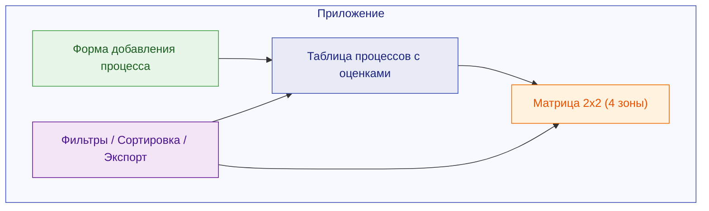

# Практическая работа: Интерактивная матрица приоритизации

**Дисциплина:** Проектирование и дизайн информационных систем
**Тип:** Практическая работа (JavaScript)
**Продолжительность:** 4 академических часа (часть 1 — 20 баллов)

---

## О чём эта работа?

На лекции мы изучали, как **матрица приоритизации** помогает определить, какие бизнес-процессы менять в первую очередь. В этой практической работе вы создадите **интерактивный веб-инструмент**, который автоматизирует построение такой матрицы.

Пользователь вашего приложения сможет:

- **Добавлять** бизнес-процессы с оценками по критериям
- **Видеть** автоматически рассчитанную матрицу (4 зоны)
- **Фильтровать и сортировать** процессы
- **Сохранять** данные в браузере (localStorage)

---

## Структура работы

  

    <h3>Этап 1 — Разметка и данные 5 баллов</h3>
    
HTML-структура, массив объектов с процессами, CSS-оформление (можно использовать Bootstrap / Tailwind / SCSS).

  

  

    <h3>Этап 2 — Рендеринг и расчёты 6 баллов</h3>
    
Динамическая генерация таблицы и карточек матрицы через JS. Расчёт средних оценок и распределение по зонам.

  

  

    <h3>Этап 3 — Интерактивность 5 баллов</h3>
    
Форма добавления процесса, удаление, сортировка по столбцам, фильтрация по зонам. Обработка событий.

  

  

    <h3>Этап 4 — Хранение и экспорт 4 балла</h3>
    
Сохранение в localStorage, загрузка при открытии страницы, кнопка сброса, экспорт в JSON-файл.

  

---

## Технические требования

| Требование | Описание |
|---|---|
| **Язык** | Vanilla JavaScript (без React, Vue, jQuery и т.д.) |
| **CSS** | Можно использовать: Bootstrap, Tailwind, Bulma, Materialize или любой CSS-фреймворк. Разрешены препроцессоры (SCSS, LESS) |
| **Количество файлов** | Минимум 3: `index.html`, `style.css` (или `.scss`), `app.js` |
| **Результат** | Ссылка на GitHub-репозиторий |
| **Песочница** | Если нет возможности работать локально — допускается CodePen / JSFiddle / StackBlitz |

---

## Что должно получиться (превью)

Ваше приложение будет выглядеть примерно так — таблица процессов сверху, матрица из 4 зон снизу:

---

!!! sandbox "Работа в песочнице"

    Если на вашем компьютере нет возможности установить редактор кода или запустить Live Server, вы можете выполнить работу в онлайн-песочнице:

    - **CodePen** — создайте новый Pen, напишите HTML/CSS/JS в трёх панелях
    - **StackBlitz** — создайте проект Static HTML, работайте как в обычном редакторе
    - **JSFiddle** — аналогично CodePen

    В этом случае вместо ссылки на GitHub пришлите ссылку на песочницу (убедитесь, что она **сохранена и доступна по ссылке**).

---

!!! insight "Связь с лекцией"

    Эта работа — не просто упражнение по JavaScript. Вы создаёте **рабочий инструмент**, который мог бы использовать аналитик при формировании стратегии развития бизнес-процессов. Вспомните кейс «ТрансЛогистик» — именно такой инструмент помог бы команде визуализировать приоритеты.
